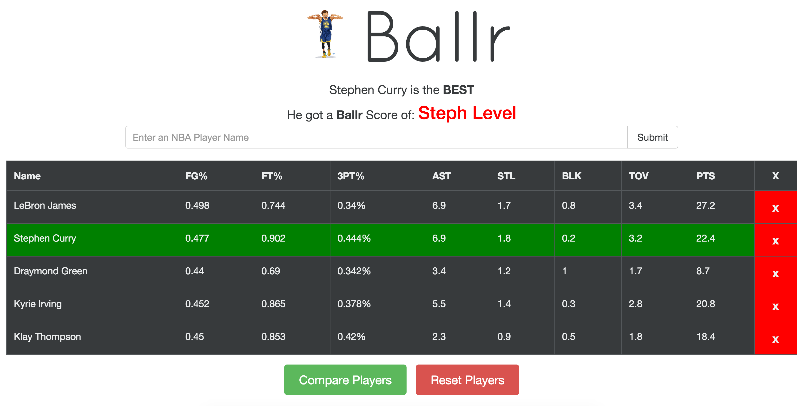

# Ballr

Ballr is an NBA comparison tool that takes the top 100 basketball players stats (scraped from www.basketball-reference.com) and allows users to compare them. Ballr assigns a specific "Ballr" score to each player and chooses the best amongst the given and displays it.

##Usage

Currently Ballr is in the process of being deployed, but for now please enjoy it through:

- `npm install` to install necessary dependencies
- `nodemon server.js` to start the server

- Then visit `localhost:3000/` to access the Ballr.

##Tech Stack
- **React** (using Redux as a global state container)
- Experimented with both **PostgreSQL** and **MongoDB** (can be interchanged)
- **Node** (using the Cheerio library) to scrape the basketball data

