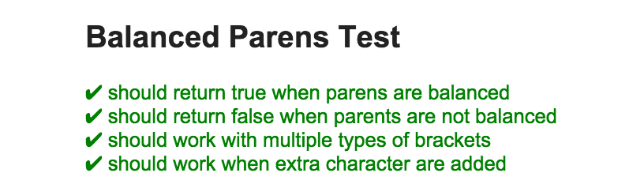

# mocha-email-reporter

[](https://nodei.co/npm/mocha-email-reporter/)

## Intro

Mocha reporter which prints an email-friendly HTML string to stdout.

## Usage

### CLI

```mocha --reporter mocha-email-reporter test```

### Node

```
var Mocha = require('mocha');
var EmailReporter = require('mocha-email-reporter');

mocha = new Mocha();
mocha.addFile('testfile');
mocha.reporter(EmailReporter).run();
// or:
mocha.reporter(EmailReporter, { json: './path/to/outputFile.json' }).run();
```

## Example output
```
"
<html>
  <h2>Balanced Parens Test</h2>
  <dt style="color: green;">✔ should return true when parens are balanced<span style="font-size: 12px;"> 6 ms </span></dt>
  <dt style="color: green;">✔ should return false when parents are not balanced<span style="font-size: 12px;"> 1 ms </span></dt>
  <dt style="color: green;">✔ should work with multiple types of brackets<span style="font-size: 12px;"> 1 ms </span></dt>
  <dt style="color: green;">✔ should work when extra character are added<span style="font-size: 12px;"> 1 ms </span></dt>
</html>
"
```



## Options

### json
- (string) - Write a .json file to provided filepath in addition to printing the results to stdout
- The json file will look like this:
```
{
  "suites": {
    "a test suite": {
      "should pass this test": {
        "start": 1453853350049,
        "pass": true,
        "duration": 1
      },
      "should fail this test": {
        "start": 1453853350051,
        "pass": false,
        "duration": 4,
        "err": {
          "showDiff": true,
          "actual": false,
          "expected": true
        }
      }
    }
  },
  "totalPasses": 1,
  "totalFailures": 1
}
```
### header
- (string) - HTML-friendly string to write before the test results
### footer
- (string) - HTML-friendly string to write after the test results
